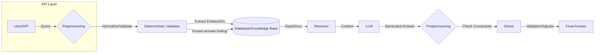
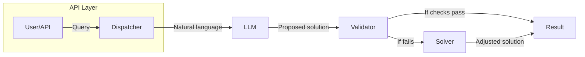

# Executive Summary

- **Hybrid AI approach**. Modern configurations combine deterministic reasoning (rules or solvers) with LLMs.  A common pattern is to **apply deterministic filters first** – e.g. input validation, database lookups, rule checking – then use the LLM only on the residual, ambiguous tasks【4†L373-L382】【29†L215-L222】.  This reduces hallucination and cost, while retaining correctness guarantees for known constraints.  
- **Knowledge base**. Ingesting product catalogs and SME docs can use a combination of structured and unstructured pipelines.  Structured product data often lives in RDB/NoSQL or a **graph database**, while unstructured manuals/PDFs are OCR’d, chunked and embedded in a vector store【18†L218-L225】【41†L151-L159】.  The result is a searchable, up-to-date knowledge foundation.  
- **Deterministic reasoning**.  A dedicated **constraint engine or rule system** enforces compatibility.  Options include rule engines (e.g. Drools), CSP/SAT solvers (OR-Tools, Z3, Google CP-SAT), or ILP solvers (Gurobi, CBC).  Rule engines are easy to author but don’t optimize; constraint solvers find *any* solution or the *optimal* one subject to constraints【20†L109-L117】【15†L70-L78】.  Tables below compare solver choices.  
- **LLM integration patterns**. Choices include in-process integration (bundling an open model), cloud/microservice APIs (e.g. OpenAI), or retrieval-augmented pipelines.  RAG is standard for grounding answers in external data【29†L198-L207】.  Alternatively, use an “agent” pattern where the LLM calls tools (e.g. the constraint solver) at runtime.  Each pattern trades off latency, control, and cost (see table below).  
- **Key risks**. LLMs can hallucinate or leak sensitive data.  Strict **validation and guardrails** are needed – e.g. using the solver to check LLM outputs or blocking forbidden responses【6†L31-L39】【32†L12-L20】.  Log every query/answer for audit, and filter PII before any model call【35†L529-L537】.  Use role-based access, encryption and monitoring to address compliance (GDPR etc.).  
- **Observability and CI/CD**. Instrumentation should log model latency, error counts, and input/output quality.  For example, RAG systems often record queries, retrieved docs, and answers for debugging【29†L215-L222】.  Deployment should use containerized services (Kubernetes or serverless) with CI/CD pipelines that include unit tests for rules/solvers and “golden” prompt tests for the LLM.  
- **Recommendation**. We recommend a **hybrid pipeline (Option 1 below)**: preprocess inputs with deterministic rules/DB, retrieve relevant knowledge (vector or graph query), then generate via LLM, and finally validate via the solver.  This architecture balances safety (deterministic checks) with flexibility (LLM handles ambiguities) and is modular for iterative improvement.  A possible migration path is: start with static rules + retrieval-based QA, then incrementally integrate the LLM and tighten validation over time.

The sections below detail system components (knowledge ingestion, solvers, LLM patterns), compare architecture options with diagrams, and summarize pros/cons and implementation considerations.

## System Components and Responsibilities

1. **Knowledge Foundation**.  Store product catalog data (SKUs, attributes, compatibility tables) and SME docs in a queryable form.  For example:
   - **Structured data store**: a relational or document database for product attributes and compatibility relations.  A *graph database* (e.g. Neo4j) is often used when products have many-to-many relationships or hierarchical attributes. Graphs excel at modeling compatibility links (e.g. “fits-with” edges)【15†L70-L78】.
   - **Unstructured knowledge base**: ingest PDF/spec documents via OCR/text extraction, then chunk and embed them into a vector database (Weaviate, Pinecone, etc) for semantic search【18†L218-L225】【41†L151-L159】.  Alternatively use an enterprise knowledge graph or search index.  
   - **Knowledge representation**: normalized schema or ontology for catalog data; indices or embeddings for text.  Compatibility rules may also be captured as boolean formulas in the knowledge base (e.g. “if product A requires B or C”).  

2. **Constraint Reasoning Engine**.  Enforces deterministic constraints (e.g. compatibility, inventory rules).  Options include:
   - **Rule engines** (Rete-based): e.g. Drools, Jess. Good for business rules (simple “if–then” logic). Fast for matching, but cannot search for solutions or handle optimization【20†L109-L117】.
   - **Constraint solvers (CSP/SAT/SMT)**: e.g. Google OR-Tools CP-SAT, MiniZinc, Z3. Solve satisfiability/optimization problems; can find any valid configuration or best fit. They require formulating variables/domains/constraints, but can enforce complex n-ary relations【15†L70-L78】【21†L15-L24】.
   - **Integer Linear Programming (ILP)**: e.g. Gurobi, CPLEX. Handles numeric constraints and optimization (max/min). Good if cost or capacity objectives exist, but scales poorly for large combinatorial logic.
   - **Hybrid (Rule + Solver)**: Some systems use both: rules for checks and solvers for finding configurations if needed【21†L15-L24】.  

   **Table: Solver/Rule Engine Options** (example comparison):

   | Solver Type         | Example Tools           | Strengths                                | Weaknesses                             | Use Cases                   |
   |---------------------|-------------------------|------------------------------------------|----------------------------------------|-----------------------------|
   | Rule Engine         | Drools, Jess, CLIPS     | Fast forward-chaining, declarative rules; explainable | Cannot search/optimize; limited to explicitly coded rules【20†L109-L117】 | Simple validation, derived attributes (e.g. if X then Y) |
   | Constraint (CSP)    | OR-Tools CP-SAT, MiniZinc| Finds any/all solutions; supports complex constraints and optimization【20†L139-L147】 | Can be complex to model; performance drops on very large/complex problems | Product configuration, scheduling |
   | SAT/SMT Solver      | Z3, MiniSAT            | Very fast on boolean logic; precise logical guarantees | Hard to encode arithmetic or non-boolean constraints | Logic consistency checking |
   | ILP Solver          | Gurobi, CPLEX, CBC     | Handles linear objectives & capacities; finds optimum solution | Requires linearization; NP-hard scaling | Cost optimization, resource allocation |
   | Graph Reasoner      | Neo4j, RDF reasoner    | Semantic queries; captures relationships naturally | Not optimized for combinatorial search | Knowledge graph queries, compatibility lookup |

   (This is illustrative – exact choice depends on problem size, expressivity needs and existing expertise.)

3. **Conversational/LLM Layer**.  The interface used by end-users (e.g. chat UI or API) drives the workflow.  Key patterns for LLM use:
   - **In-Process / Local Model**: Embedding an open-source LLM (like Llama 2) in the same service avoids network calls, but demands heavy local compute and memory. Latency can be low if model is small enough, but larger models will hurt throughput and scale.  
   - **Remote API / Microservice**: Calling a hosted LLM (GPT-4, Claude) via API offers high capability and updates, but adds network latency and per-call cost. Cold-start (spin-up) latency and rate limits may be an issue.  
   - **Retrieval-Augmented Generation (RAG)**: A dedicated retrieval step fetches relevant knowledge (documents, database records) into the prompt, as described by IBM【41†L151-L159】.  RAG grounds the LLM’s output in factual data, reducing hallucinations【29†L198-L207】. It introduces extra service components (vector DB, retrieval logic) but improves accuracy.  
   - **Tool/Agent Integration**: The LLM may be given access to tools or APIs (e.g. “checkCompatibility(productA, productB)”). In this pattern, the LLM reasons about the query and calls external functions (constraint solver, DB queries) as needed【4†L463-L472】. This provides strong correctness (the solver enforces rules) but requires orchestrating multiple steps.  

   **Table: LLM Integration Patterns**

   | Pattern            | Description                                      | Pros                                           | Cons / Risks                                | Examples                 |
   |--------------------|--------------------------------------------------|------------------------------------------------|---------------------------------------------|--------------------------|
   | In-Process Model   | LLM runs within application container (local model)| Low network overhead, control over model         | Resource-intensive; model size limits; updating model can be complex | Llama2 backend; HF | 
   | Cloud API (Microservice) | LLM accessed via external API (OpenAI, etc) | High-quality model; managed service; easy upgrade | Higher latency/cost; vendor lock-in; data exposure to third-party | OpenAI GPT-4 API |
   | Retrieval-Augmented | Combine LLM with retrieval (vector DB, search)  | Grounded answers; reduces hallucination【29†L198-L207】; traceability | More components (DB, retriever); added latency for retrieval | Pinecone + LangChain |
   | Tool Use / Agent    | LLM calls tools (code execution, solvers)       | Ensures determinism for critical tasks; modular | Complexity (NLU to API mapping); risk if tools produce wrong output | LangChain Agents |
   | Fine-Tuning        | Adapt LLM by retraining on company data         | Improves domain fit; fast inference at runtime | Expensive retraining; updates needed for new data; legal issues with IP | Custom GPT models |

   (E.g., RAG is especially common for question-answering with knowledge bases【25†L181-L190】【41†L151-L159】. Agentic patterns can incorporate solvers as external tools.)

## Data Ingestion & Knowledge Representation

- **Product Catalogs**: Typically structured (e.g. CSV, database dump). Ingest via ETL into a relational or NoSQL database.  Use a clear schema (entities like Product, Feature, CompatibilityRule). A **knowledge graph** or graph DB can naturally encode compatibility relationships (edges "incompatibleWith", "dependsOn", etc)【15†L70-L78】. Graph queries (Cypher/SPARQL) can then support lookup of related items.  
- **SME Documents (PDFs, manuals)**: Use OCR/text-extraction (e.g. Tesseract, AWS Textract) to convert to text. Then **chunk** the text (by paragraph or semantic sections) and index it. A common pipeline is: *text chunking → embedding → vector DB*【18†L218-L225】【41†L151-L159】.  During query time, a nearest-neighbor search retrieves relevant chunks. These can also be stored in a conventional search engine (Elasticsearch) or a knowledge base system.  
- **Metadata and Ontologies**: Add taxonomy tags, categories, or ontologies (e.g. product families, standards) to structure knowledge. If using a graph or RDF store, define a schema (RDFS/OWL) for products and attributes.  
- **Versioning/Updates**: Keep metadata (timestamps, version numbers) for data lineage. For dynamic catalogs, set up incremental ingestion (e.g. nightly jobs that update changed records and re-index documents).

## Deterministic Solver Choices

Key considerations: expressivity, performance, integration ease.  Recent trends include using **constraint solvers with standardized interfaces**, e.g. Anthropic’s Model Context Protocol (MCP) allows exposing a solver as a service to the LLM【6†L31-L39】. Major categories:

- **Rule Engines**: Best when rules are fairly static and simple. Quick response, but limited logic (e.g. no backtracking or optimization). They are suitable for input validation or enforcing business invariants (e.g. “each order must have at least one item”). However, they can’t “solve” configurations.  
- **Constraint Solvers (CSP/SAT/SMT)**: Ideal for configuration. They ensure consistency across many constraints and can find solutions or prove infeasibility. For example, OR-Tools CP-SAT is highly optimized for integer constraints【23†L0-L4】. An SMT solver like Z3 handles logical and arithmetic constraints. These offer correctness: any solution given satisfies all constraints. The trade-off is modeling complexity and solve time on large problems.  
- **ILP Solvers**: Use when linear costs or capacities are present. They can optimize objectives (e.g. minimize cost). But general compatibility rules must be expressed in integer form, which can be harder.  
- **Hybrid (Rule + Solver)**: A proven approach is to use rules for quickly reducing the search space or validating certain conditions, then fall back on a solver for the remainder【21†L15-L24】. For instance, simple compatibility (A→B) can be a rule, while complex resource allocation uses CSP.  

_Table: Solver Tools Comparison (non-exhaustive)_: 

| Category      | Tool/Language    | Open/Closed | Core Domain           | Notes (Strengths / Drawbacks)                           |
|---------------|------------------|-------------|-----------------------|----------------------------------------------------------|
| Rule engine   | Drools, CLIPS    | Open        | Forward-chaining      | Easy rule writing; lacks optimization/searching【20†L109-L117】 |
| CP Solver     | Google OR-Tools  | Open        | CP-SAT (mixed ints)   | Fast on combinatorial problems; needs careful modeling  |
| SMT Solver    | Z3, CVC5         | Open        | Logic + arithmetic    | Powerful theorem proving; steep learning curve         |
| ILP Solver    | Gurobi (C), CBC  | Closed/Open | Linear optimization   | Best at numeric opt; poor for non-linear rules         |
| Graph DB      | Neo4j, TigerGraph| Mostly Open | Graph queries         | Intuitive for relations; not a solver per se           |

*Implementation risk*: Choosing the wrong solver can bottleneck performance or complicate development. For example, pure constraint models may not express all domain rules (as [20†L164-L173] notes), so hybridizing with rules is often needed.

## LLM Integration Patterns

LLMs bring flexibility but also cost/latency and unpredictability. Trade-offs include response time, scalability, and control over outputs. Key patterns:

- **In-Process (Local Inference)**: Running an open LLM inside your service (e.g. via HuggingFace Transformers). Pros: low per-call latency (no external API hop); privacy (data stays in your servers). Cons: requires powerful GPUs or CPUs, and the model may need to be smaller (e.g. Llama-2 variants). This suits high-throughput cases on fixed hardware.  
- **Microservice (Remote API)**: Common in 2026. The LLM runs as a separate service or cloud function (e.g. OpenAI, Azure OpenAI). Pros: access to very large models, automatic updates, SLAs. Cons: variable latency, network overhead, per-token billing. Also, sending proprietary data to a 3rd-party model raises IP/PII concerns【35†L527-L537】.  
- **Retrieval-Augmented Generation (RAG)**: Here, the model is always given a “context” from an external knowledge base. RAG is described as the leading pattern for grounded LLM apps【29†L181-L190】. It ensures the model’s output is supported by real data. The trade-off is the extra retrieval step (increasing response time) and complexity of maintaining the vector DB and search pipelines. However, it greatly improves factual accuracy.  
- **Tool Use / Agents**: In this design, the LLM itself is treated as an agent orchestrator. Given a query, it may call external APIs (like the constraint solver) or code (via Python execution) to get answers. For example, an LLM might generate a function call “checkCompatibility(A,B)” and the system executes it. This ensures the heavy lifting (enforcing constraints) is done deterministically by the external tool. Complexity arises in building the “reflection” layer that translates LLM plans to tool calls.  
- **Fine-Tuning vs Prompting**: Instead of external tools, one could embed knowledge directly into the model via fine-tuning. While fine-tuned models can answer better for fixed catalogs, they quickly become stale and cannot easily reflect new product data. For regulated/product-critical domains, RAG (which uses live data) is generally safer and more maintainable【41†L59-L68】.  

_Table: LLM Integration Options_ 

| Pattern         | Key Idea                                    | Latency/Scale          | Control/Correctness            | Common Use      |
|-----------------|---------------------------------------------|------------------------|-------------------------------|-----------------|
| Local Model     | Embed model in service                       | Low (on local HW); scales by own infra | Full control; reproducible| Internal customer support bots |
| Remote API      | Call cloud LLM (OpenAI etc)                  | Medium (API latency); external scaling | Dependent on provider; black-box answers | Prototypes; high-capability needs |
| RAG Pipeline    | Retrieval step → LLM generation【29†L198-L207】 | Higher (retrieval + LLM) | High factual accuracy; cites sources | Knowledge Q&A, documentation bots |
| Agent/Tool Use  | LLM invokes external tools (e.g. solver)【4†L463-L472】 | Variable (depends on tools) | Very high (deterministic tools handle logic) | Complex workflows, code synthesis |
| Fine-tuned LLM  | Model retrained on company data             | Low (just LLM call)    | Moderate (improved domain knowledge, but no runtime checks) | Niche product domain with stable data |

## Latency, Scalability, and Consistency

- **Latency**: LLM calls (especially large models) add significant delay compared to in-memory logic.  Each 1–2s LLM call can be a bottleneck【2†L237-L246】.  Solutions: use caching of frequent queries, smaller models where possible, batching, or async workflows.  Deterministic logic (regex, DB queries, rule firing) typically runs in milliseconds, so filter as much as possible before invoking the LLM【4†L373-L382】.  
- **Scalability**: LLM inference scales differently than traditional services. If using cloud APIs, scale is limited by throughput agreements. For local GPUs, you must manage concurrency and load (e.g. using GPU queues, model parallelism, or multi-instance deployment). In contrast, rule engines and databases can often scale out more linearly (e.g. sharding a DB, clustering a rule server).  Architect for mixed loads: heavy pre-filtering reduces calls to the costly LLM component【2†L237-L246】.  
- **Consistency & Correctness**: A deterministic pipeline enforces business rules consistently. In hybrid systems, use **validation steps**: e.g. after the LLM proposes an answer, run the solver on it to verify all constraints still hold【6†L31-L39】. If not, handle fallback (e.g. retry with adjusted prompt or return an error). The MCP-Solver model shows one approach: each proposed model change is validated before acceptance【32†L30-L38】, ensuring no illegal state. Logging these checks helps diagnose issues. Overall, the design should guarantee that any decision-critical output (like final product configuration) comes from the deterministic layer or is cross-checked by it.  

## Security, Privacy, and Compliance

- **Data Sensitivity**. Product catalogs may contain IP, pricing, customer info or PII. Do *not* send raw sensitive data to third-party LLM APIs without filtering【35†L527-L537】. Techniques include: token anonymization, redaction (regex or model-based detection), and minimal data transfer. For example, only send abstracted IDs or non-PII attributes in prompts.  
- **Access Controls**. Implement strict RBAC: only authorized services or users can query the LLM component. Use token authentication and encrypted channels. Encrypt any logs or stored embeddings that might contain sensitive text.  
- **LLM Output Risk**. Guardrails on outputs are crucial. E.g. whitelist/blacklist filters on generated text, and use a “judge model” or heuristics to detect hallucinations or disallowed content【2†L237-L246】. Logging and human review of edge cases (few-shot outputs, especially) are recommended.  
- **Regulatory Compliance**. Depending on jurisdiction, ensure data residency laws (e.g. GDPR) are followed. Some enterprises may prefer on-prem or VPC-hosted LLM services to avoid data egress. For regulated industries, every query and answer should be auditable; record data lineage.  
- **Model Leakage**. Be aware of “model memorization” attacks. If fine-tuning or using a proprietary model, scrub training data of PII. If using hosted LLMs, check provider’s data usage policies.  

_Security Best Practices (from industry)_: “Implement access controls, minimize data input, validate/sanitize inputs, and encrypt data” are fundamental steps【35†L529-L537】. Monitoring and regular audits (including adversarial testing) are also advised【35†L529-L537】.

## Observability and Monitoring

For robustness, track metrics at each layer:

- **User/API metrics**: request rates, latencies, error counts for both the deterministic service and LLM service.  
- **LLM-specific metrics**: token usage, throughput, and response time. Watch for spikes in timeouts or rejected calls.  
- **Quality metrics**: e.g. success rate of constraint validation after LLM answers, proportion of hallucinations (via sampling), end-user satisfaction scores.  
- **Retrieval stats**: hit rates on the vector DB, top-1 relevance. 
- **Logging**: Log inputs, outputs, retrieval results (with redaction), and solver decisions in an anonymized way for auditing. Tools like DataDog have LLM integrations【36†L1-L7】. RAG pipelines often explicitly log the source documents used for transparency【29†L215-L222】.  
- **Alerts**: e.g. if LLM error rate exceeds threshold, or if query latency spikes beyond SLO.  

Integration with a monitoring platform (Prometheus/Grafana, OpenTelemetry) is recommended. The recently announced OpenAI–Neptune partnership underscores the industry focus on model observability【37†L127-L136】.

## Deployment, CI/CD and DevOps

- **Microservices**. Each component (API gateway, rule engine, solver, retriever, LLM interface) can be containerized. For example, use Docker/Kubernetes with autoscaling groups: CPU-based pods for rules/DB, GPU-enabled pods for LLM inference.  
- **Infrastructure**. Cloud offerings: AWS SageMaker/Bedrock, Azure OpenAI, or on-prem stacks (e.g. Kubeflow on K8s). Use managed vector DB (Pinecone, Weaviate Cloud) or self-hosted ones. CI/CD pipelines (GitLab CI, GitHub Actions) should build and test service containers, then deploy to dev/staging/production clusters.  
- **Testing**: Besides unit tests for code, include **integration tests** using known QA pairs. For the LLM, include “prompt tests”: fixed prompts with expected (checked) answers. Also include policy tests for security (e.g. input sanitization).  
- **Versioning**: Treat prompts and pipeline configs as code in Git. Use semantic versioning for model updates. Maintain a registry of model weights (MLflow or HuggingFace Hub) and solver configurations.  
- **Rollback/Canary**: Deploy new LLM versions (or solver updates) initially to a small user subset (canary) and monitor correctness/feedback before full rollout.  

## Team, Skills, Timeline, Cost

- **Team**: A hybrid system needs cross-functional experts: *AI/ML engineers* (LLMs, embeddings), *Backend developers* (services, APIs), *Data engineers* (ETL, databases), *Constraint specialists* (familiar with CP/SAT), *DevOps* (CI/CD, cloud). Possibly a *domain expert* (to validate rules) and a *security/privacy officer* for compliance.  
- **Skills**: Python/Java/Go for services; familiarity with ML frameworks (PyTorch, LangChain); experience with solvers (OR-Tools, Z3) and rule engines; knowledge of vector DBs and databases; cloud ops skills.  
- **Timeline**: A first prototype (MVP) could be done in ~3–6 months, focusing on a subset of products and rules, and using an existing LLM API. Further refinement (production hardening, scalability, additional features) may take another 6–12 months. Total 9–18 months for a robust system, depending on resource availability.  
- **Cost**: Licensing/training: Open-source models have no license fee but need compute. Hosted LLM costs (e.g. $0.03–0.12 per 1K tokens) can add up, especially for many queries. Constraint solvers like OR-Tools are free; commercial solvers (Gurobi) may have license costs. Infrastructure: GPUs for LLM inference can be expensive; however, since most logic is deterministic, the LLM load might be moderate. Using RAG reduces model call costs by narrowing the prompt context.  Monitoring and storage (vector DB, logs) also incur cloud fees. Building on existing cloud NLP services (AWS/Azure/GCP) can speed development but may lock into pricing tiers.  

## Architecture Options

Below are **four candidate architectures**. Each is sketched in mermaid diagrams, with pros/cons and risks.

### Option 1: Deterministic-First Pipeline (RAG + LLM Fallback)



**Flow**:  
1. **Preprocessing (Deterministic)**: Clean input (length checks, regex extraction).  
2. **Deterministic rule checks / DB lookup**: E.g. if question matches known FAQ or the desired answer is in DB, return immediately. Also extract structured values (product IDs, dates) via regex or lookup.  
3. **Retrieval**: Query vector DB or search index with user query; retrieve relevant document snippets.  
4. **LLM**: Prompt the LLM with user query + retrieved context, asking it to answer or reason about product compatibility.  
5. **Postprocessing**: Validate and possibly correct the LLM output. For example, run the constraint solver on the LLM’s proposed solution to ensure all rules are satisfied【6†L31-L39】. If invalid, either adjust the answer or flag an error.  

**Pros**: 
- *Safety & accuracy*: Most trivial or pattern-based queries are handled by fast deterministic code. LLM only used where needed (residual uncertainty)【4†L373-L382】, reducing cost and hallucination.  
- *Explainability*: Constraint solver ensures final consistency; can provide explanations (e.g. “removed incompatible item”).  
- *Modularity*: Each stage is a separate component (rule engine, vector DB, LLM). Easy to replace or improve a part (e.g. swap vector DB).  

**Cons/Risks**:
- *Complexity*: Many moving parts (data pipeline, vector DB, LLM). More integration overhead.  
- *Latency*: Multi-stage pipeline (retrieval + LLM + solver) can increase response time. Must optimize (e.g. async retrieval).  
- *Coverage*: If knowledge base or rules are incomplete, the LLM may still hallucinate. Mitigation: log unrecognized queries for iterative rule addition.  

**Use Case Fit**: This is generally recommended as a robust “best-of-both-worlds” architecture【29†L198-L207】【6†L31-L39】. It can start simple (no LLM, just rules+search) and gradually incorporate the LLM.

### Option 2: LLM-Centric with On-the-Fly Constraint Checking



**Flow**:  
- The system directly sends the raw query to the LLM (possibly with minimal formatting).  
- The LLM outputs a complete answer (e.g. a proposed configuration or answer).  
- A **validator** checks the LLM output against rules. If valid, return it. If invalid, send the answer (or relevant parts) to a **solver**, which repairs it to satisfy constraints, and return that corrected answer.  

**Pros**:  
- *Simplicity (initial)*: Bypasses initial rule engine; fewer pre-steps.  
- *Flexibility*: LLM can handle unexpected queries or formulations.  
- *Catch-all*: Even if the LLM “hallucinates” an answer, the validator/solver will enforce hard constraints, preventing illegal configurations.  

**Cons**:  
- *Reliance on LLM quality*: Because no RAG or context is provided, the LLM may make many guesses. The solver then has to catch/fix errors. This may bounce many times, hurting latency.  
- *No grounding*: The answer may be factually wrong if not checked by data.  
- *Wasted cycles*: The LLM may propose many impossible solutions before a valid one emerges.  
- *Error feedback loop*: Designing the repair step (LLM→Solver→LLM) is complex.  

**Use Case Fit**: This architecture treats the LLM as the primary reasoning engine, with the solver as a safety net. It might be suitable if the LLM is very capable on-domain, and constraints are mainly simple checks. For critical correctness, one must handle fallback paths carefully (e.g. if solver cannot fix it, have a clear error response).

### Option 3: Knowledge Graph + LLM Hybrid

```mermaid
flowchart LR
  subgraph Data Layer
    Graph[(Knowledge Graph)]
  end
  subgraph Application
    U[User/API] -->|Query| NLProcessor
    NLProcessor -->|Graph Query (SPARQL/Cypher)| Graph
    Graph -->|Structured Data| KGResponse
    NLProcessor -->|LLM Prompt (with KG facts)| LLM
    LLM -->|Answer| Output
  end
```

**Flow**:  
- Parse the natural query to both a graph query (via templates or an LLM) and to generate LLM prompts.  
- Retrieve structured facts from the KG (e.g. “retrieve all compatible parts of model X” using Cypher/SPARQL).  
- Provide those facts as part of the context to the LLM, which then formulates a response.  

**Pros**:  
- *Structured reasoning*: The graph stores explicit relationships and can answer straightforward queries (e.g. “list compatible accessories”).  
- *Explainable*: The KG facts are explicit and can be cited.  
- *RAG-like effect*: The graph acts as a curated knowledge store, reducing reliance on free-text retrieval.  
- *Flexible querying*: The LLM can handle user’s ambiguous phrasing, converting it to graph queries or explaining results in natural language.  

**Cons**:  
- *Complexity of NL→Query*: Translating user language to a graph query is non-trivial; often requires its own NLP component or semantic layer.  
- *Graph completeness*: The graph must be well-populated. Building it (from scratch or from existing DB) is labor-intensive.  
- *Scalability*: Very large graphs can become slow for complex queries. Also, not ideal for unstructured content (hence may still use vector search for manuals).  

**Use Case Fit**: This suits organizations with rich ontologies or where relationships are core. For product catalogs with lots of structured relationships, it gives strong guarantees. It’s like RAG but with a graph DB instead of a text vector DB.  

### Option 4: Agentic / Tool-Oriented System

```mermaid
flowchart LR
  U[User/API] -->|Query| Agent
  subgraph LLM-Agent
    Agent -->|Ask Tool:| LLM
  end
  LLM -->|Decision| {Call Solver?}
  {Call Solver?} -->|Yes| Solver
  {Call Solver?} -->|No| Output
  Solver -->|Result to LLM| LLM
  LLM -->|Final Answer| Output
```

**Flow**:  
- The LLM is given the role of an “agent” with access to tools (APIs) for the knowledge base and solver.  
- For each query, the LLM decides (via its output) whether to call the solver or fetch data. For example, it might output something like:  
  ```
  ACTION: check_compatibility(partA, partB)
  ```
- The system executes that action (calling the deterministic service) and feeds the result back into the LLM’s prompt for a final answer.  

**Pros**:  
- *Unified model*: One conversational LLM orchestrates everything, which can make extensions easier (just add more tools).  
- *Highly deterministic results*: All rules are ultimately enforced by tools, not left to the LLM.  
- *Interactive dialogue*: The LLM can ask clarification, loop, or call multiple tools sequentially.  

**Cons**:  
- *Engineering overhead*: Building a safe “action parser” and environment to let LLM make calls is complex.  
- *Latency*: Each roundtrip LLM→tool→LLM adds time.  
- *Robustness*: Requires very careful prompt engineering to keep the LLM from doing disallowed operations or misusing tools.  
- *Overkill for static queries*: May be too heavy if tasks are simple Q&A.  

**Use Case Fit**: This is cutting-edge (Agentic AI) and best for complex, multi-step tasks (like configuring a very customizable product). It allows dynamic interplay but has the highest implementation complexity. Companies like LangChain or Microsoft’s Copilot for SAP employ similar patterns.

## Option Comparison and Recommendation

| Option                               | Description                                          | Pros                                          | Cons / Risks                               |
|--------------------------------------|------------------------------------------------------|-----------------------------------------------|--------------------------------------------|
| 1. Deterministic-First Pipeline      | Rules/DB + RAG + LLM + Validator (as above)          | Balanced: safety of rules, flexibility of LLM; incremental deployment【4†L373-L382】 | More components to manage; moderate latency |
| 2. LLM-Centric + Post-Check          | LLM answers then solver checks/fixes                  | Simple pipeline; LLM handles most logic       | Depends heavily on LLM quality; risk of nonsensical replies; possible iterative loops |
| 3. Knowledge-Graph + LLM            | Graph queries + LLM for NL interface                | Strong structure, explainability; good for rich relational data【15†L70-L78】 | Hard to parse free text to graph query; building KG upfront is heavy effort |
| 4. Agent/Tool-Based (LLM calls solver) | LLM orchestrates calls to solver and DB               | Very flexible, can handle complex flows       | Highly complex; challenging to secure and optimize; latency with multiple calls |

**Recommended Choice**: **Option 1 (Deterministic-First Pipeline)**.  It aligns with best practices observed in industry (promoting deterministic risk control first【4†L373-L382】). We can start by building the knowledge base and rule engine, and use the LLM to handle only the ambiguous parts.  This path is incremental: initially run only rules/DB for known questions, then layer on RAG and an LLM. Its modularity means we can swap components (e.g. test out different solvers or switch LLM vendors) without breaking the core flow【4†L463-L472】.  

**Migration Path**: 
1. **Phase 1 – Static QA**: Ingest catalogs into a database and SME docs into a search index. Implement a rule-based engine for basic validation. Use a simple retrieval-based QA system (e.g. keyword search). 
2. **Phase 2 – Add LLM**: Integrate the LLM as a fallback: if rules/DB don’t fully answer, use an LLM with RAG over the retrieved documents【29†L198-L207】. Continually refine prompts. 
3. **Phase 3 – Constraint Solver**: Integrate the constraint solver for final answer checking. Expand rule coverage based on observed gaps. 
4. **Phase 4 – Optimization & Tools**: Optionally, optimize with caching, or experiment with an agentic approach for very complex scenarios.  

Regularly gather metrics and user feedback to adjust. The iterative approach ensures value at each stage while controlling risk.

## Sources

Our analysis is grounded in current industry and academic sources.  For instance, the concept of combining **deterministic and probabilistic** modules is discussed in Dev.to and research on hybrid AI【4†L373-L382】【6†L31-L39】. Best practices for RAG pipelines and knowledge ingestion are outlined by IBM and Neo4j【41†L151-L159】【18†L218-L225】. Constraint vs rule trade-offs are covered in CPQ literature【20†L109-L117】【15†L70-L78】. Security considerations draw on OWASP-style guidance【35†L529-L537】. Citations above refer to these primary references.