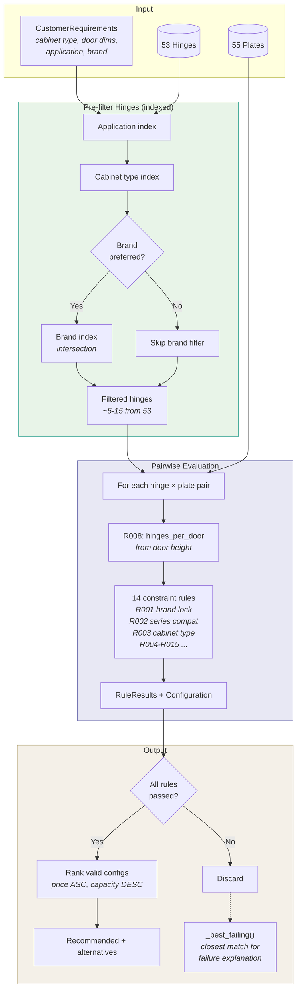
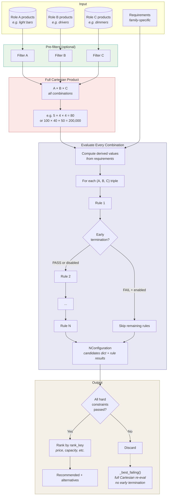
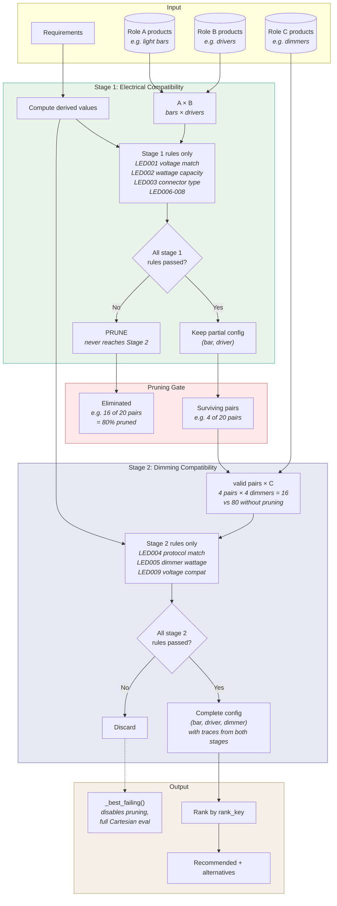
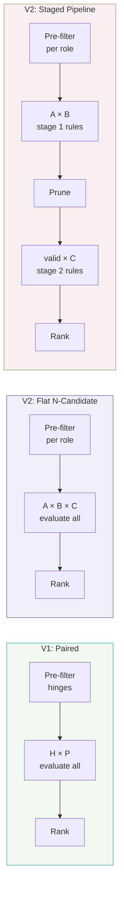

# Solver Architecture Diagrams

Visual comparison of the three constraint solver approaches used in this project.

---

## 1. V1 Paired Solver (`engine_v1/solver.py`)

The original hinge constraint engine. Handles two-product families (hinge + mounting plate) with indexed pre-filtering on hinges before brute-force plate evaluation.

**Key characteristics:**
- Pre-filter indexes narrow hinges before evaluation (53 → ~5-15)
- All plates evaluated against every filtered hinge
- Fixed two-product structure (hinge + plate)
- 14 rules, all evaluated per pair (no early termination)

---

## 2. V2 Flat N-Candidate Solver (`engine_v2/core/solver_n.py`)

Generalised solver for families with any number of product roles. Computes the full Cartesian product and evaluates every combination against every rule.

**Key characteristics:**
- Supports arbitrary number of product roles
- No pruning between roles — every combination visited
- Early termination skips remaining rules on first hard failure (per combination)
- Redundant work: a bad A-B pair is re-tested with every C
- Simple to configure: one flat rule list

---

## 3. V2 Staged Pipeline Solver (`engine_v2/core/solver_staged.py`)

Optimised solver that decomposes evaluation into sequential stages. Each stage introduces new product roles and prunes invalid partial configurations before the next stage.

**Key characteristics:**
- Stages introduce roles incrementally — not all products evaluated at once
- Invalid partial configs pruned between stages (the key optimisation)
- Constraint traces accumulate across stages — final output identical to flat solver
- Failure analysis disables pruning (must search full space for closest match)
- More complex config: rules must be assigned to stages

---

## Comparison at a Glance

| | V1 Paired | V2 Flat N-Candidate | V2 Staged Pipeline |
|---|---|---|---|
| **Product roles** | 2 (fixed) | N (generic) | N (generic) |
| **Pre-filtering** | Indexed (brand/type/app) | Optional hooks | Optional hooks |
| **Search strategy** | Filtered × all | Full Cartesian | Staged Cartesian with pruning |
| **Complexity** | O(F × P × R) | O(∏Roles × R) | O(A×B×R₁) + O(valid×C×R₂) |
| **Inter-role pruning** | N/A (only 2 roles) | None | Between stages |
| **Early termination** | No | Per-combination | Per-combination per-stage |
| **Failure analysis** | Brand fallback + closest | Full Cartesian (no ET) | Full Cartesian (no pruning) |
| **Config complexity** | Low | Low | Medium (stage decomposition) |
| **Best for** | Hinge+plate pairs | Small catalogs, analytics | Large catalogs, APIs |
| **Demo notebook** | `v1_hinge_constraint_demo` | `v2_n_candidate_demo` | `v2_staged_pipeline_demo` |
