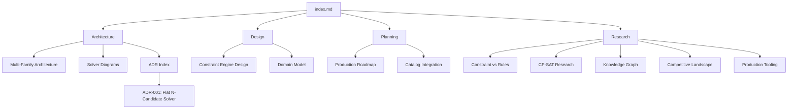

# Window — Constraint Engine Documentation

Central navigation hub for all project documentation.

## Architecture

- [Multi-Family Architecture](architecture/multi-family-architecture.md) — Generic vs independent engines, N-candidate vs staged, plain-English appendices
- [Solver Architecture Diagrams](architecture/solver-architecture-diagrams.md) — Mermaid flowcharts comparing all three solver approaches
- [Architecture Decision Records](architecture/decisions/README.md) — Index of all ADRs

## Design

- [Constraint Engine Design](design/DESIGN-constraint-engine.md) — Core rules reference, architecture, design principles
- [Domain Model](design/DESIGN-domain-model.md) — Product and configuration domain model

## Planning

- [Planning Index](planning/INDEX.md) — Prioritised work queue and plan status
- [Production Roadmap](planning/PLAN-production-roadmap.md) — Phased plan from PoC to production
- [Catalog Integration](planning/PLAN-catalog-integration.md) — Data tiers, ingestion pipeline, known gaps

## Research

- [Research Index](research/README.md) — All studies and evaluations
- [Constraint-Based vs Rules-Based](research/constraint-based-vs-rules-based.md) — Approach comparison with Tacton deep dive
- [Competitive Landscape](research/competitive-landscape.md) — Market research for cabinet hardware configuration

## Demo Notebooks

- `demo/v1_hinge_constraint_demo.ipynb` — V1 paired engine walkthrough (concealed hinges)
- `demo/v2_n_candidate_demo.ipynb` — Flat N-candidate benchmarks (LED lighting)
- `demo/v2_staged_pipeline_demo.ipynb` — Staged pipeline benchmarks and pruning analysis

## Document Map

